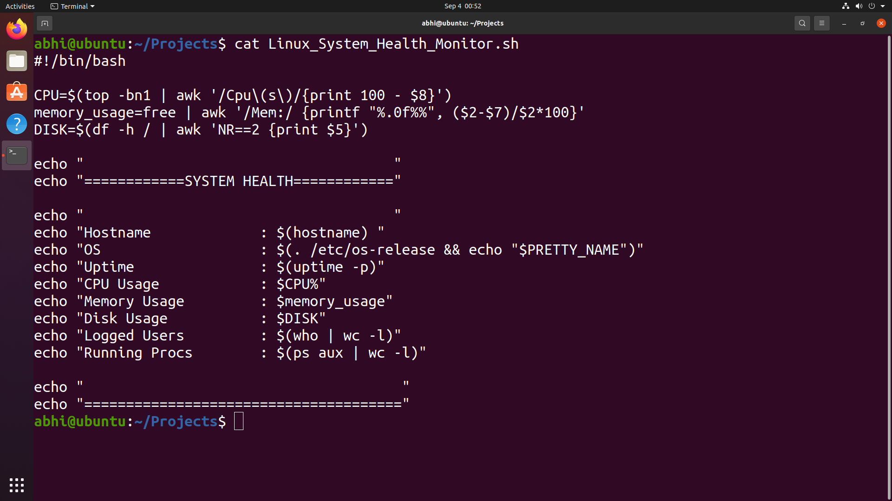
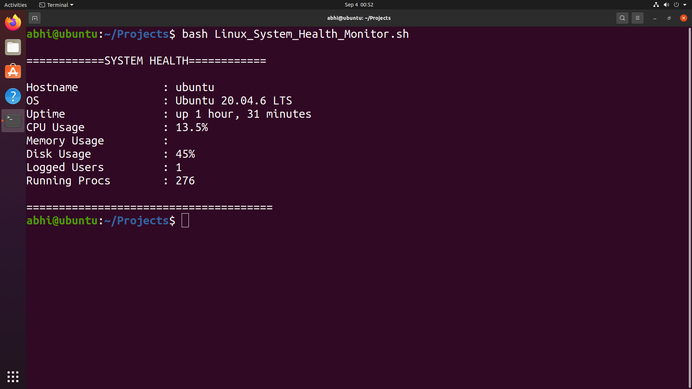

# 🖥️ Linux System Health Monitor

A simple **Bash-based Linux System Health Monitor** that displays important system information and resource usage directly in the terminal.

## 📸 Project Screenshots

### 📝 Bash Script



### 📊 System Health Output




#  📌 Features

- 🖥️ Hostname
- 🐧 Operating System
- ⏱️ System Uptime
- ⚙️ CPU Usage
- 🧠 Memory Usage
- 💾 Disk Usage
- 👤 Logged-in Users
- 🔄 Running Processes

# 🛠️ Technologies Used

- Linux
- Bash
- AWK
- Linux System Utilities

#  📂 Project Structure

```text
Linux-System-Health-Monitor/
├── Linux_System_Health_Monitor.sh
└── README.md
```
# 🚀 How to Run

## 1. Clone the Repository
- git clone <YOUR-REPOSITORY-URL>
- cd Linux-System-Health-Monitor

## 2. Give Execute Permission
- chmod +x Linux_System_Health_Monitor.sh

## 3. Run the Script
- ./Linux_System_Health_Monitor.sh
- Or:
- bash Linux_System_Health_Monitor.sh

# 📊 Sample Output
```
============SYSTEM HEALTH============

Hostname              : ubuntu
OS                    : Ubuntu 20.04.6 LTS
Uptime                : up 1 hour, 31 minutes
CPU Usage             : 13.5%
Memory Usage          : XX%
Disk Usage            : 45%
Logged Users           : 1
Running Procs          : 276

=======================================
```

#  🔍 Commands Used
```
| Information       | Command            |
| ----------------- | ------------------ |
| Hostname          | `hostname`         |
| OS Information    | `/etc/os-release`  |
| Uptime            | `uptime -p`        |
| CPU Usage         | `top` + `awk`      |
| Memory Usage      | `free` + `awk`     |
| Disk Usage        | `df` + `awk`       |
| Logged Users      | `who` + `wc -l`    |
| Running Processes | `ps aux` + `wc -l` |
```

#  📚 What I Learned
- Through this project, I practiced:
- Bash scripting
- Variables
- Command substitution $()
- Pipes |
- AWK text processing
- Linux system commands
- CPU monitoring
- Memory monitoring
- Disk monitoring
- Process monitoring
- Basic system administration

# 👨‍💻 Author
- Abhishek Pundir
- Learning and building projects in:
- Linux • Bash • Networking • Python • Cloud • DevOps

# ⭐ Support
- If you found this project useful, consider giving it a ⭐ on GitHub.
